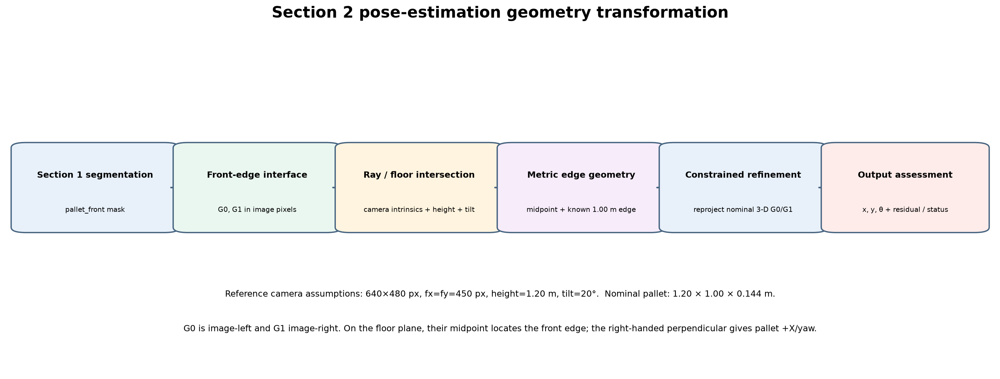
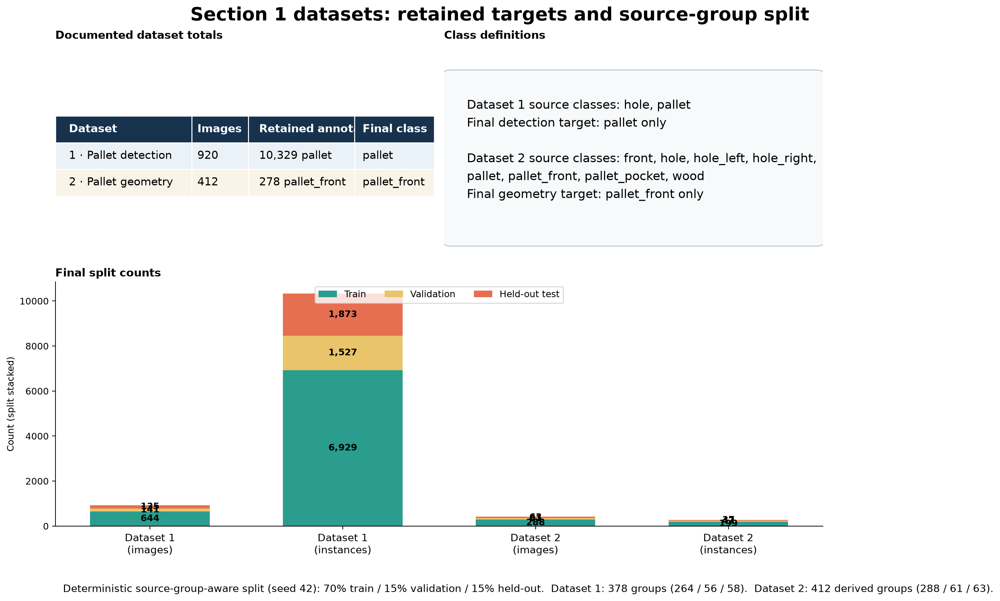
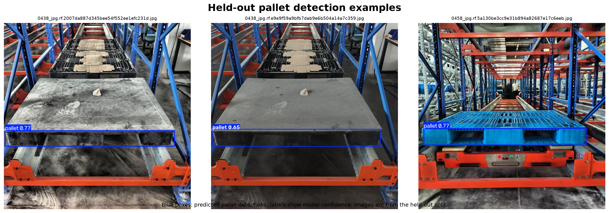
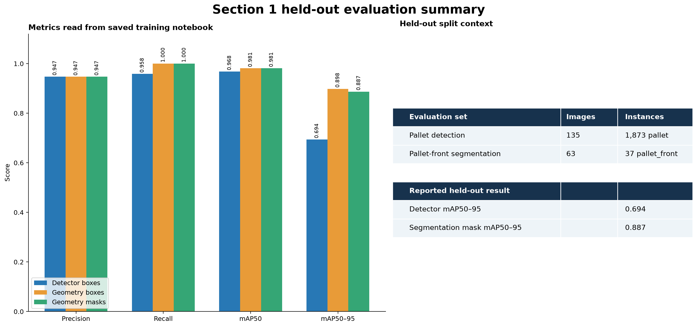
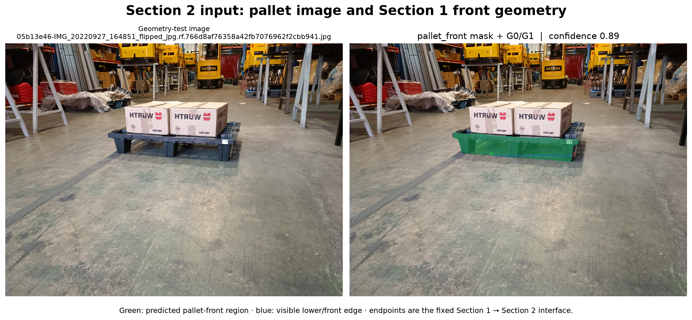
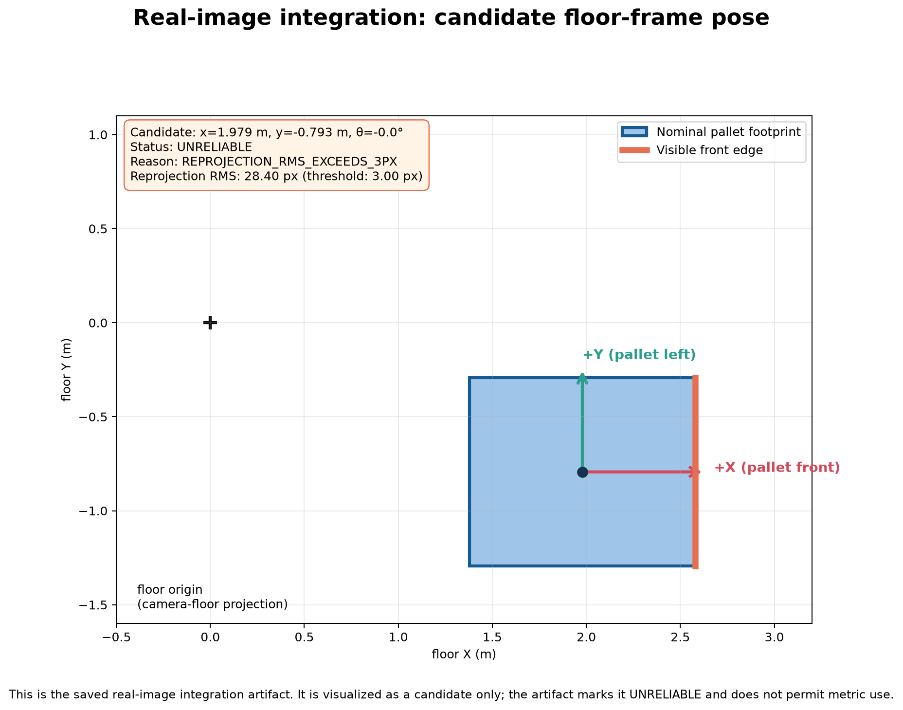
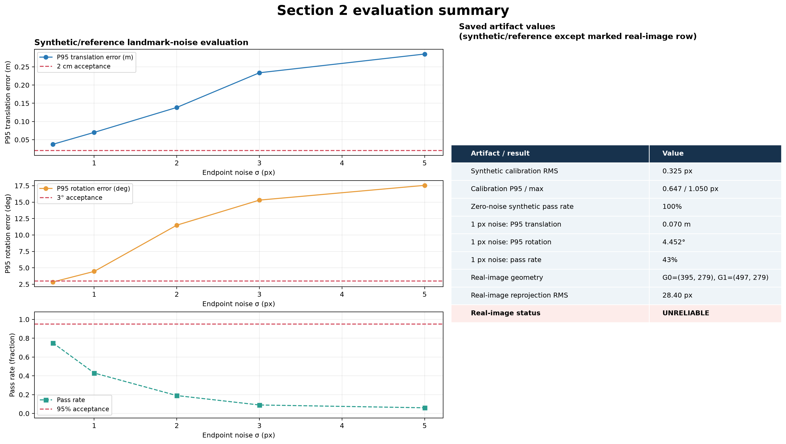
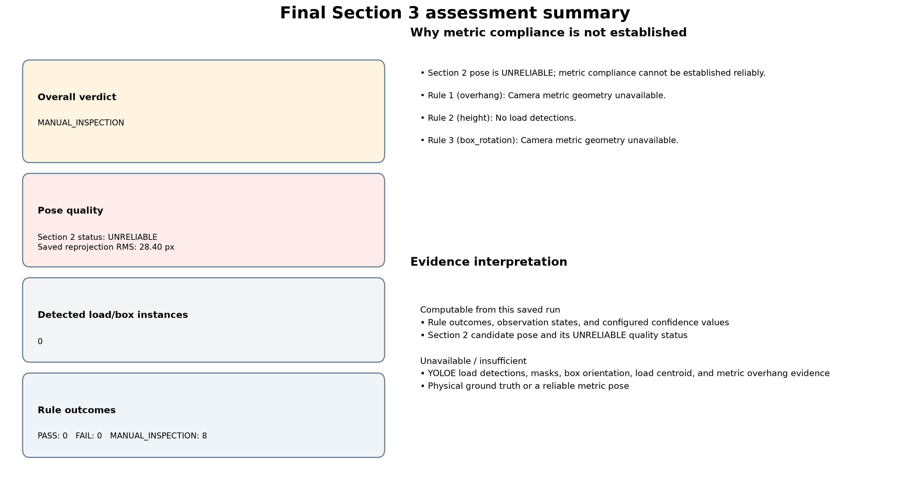
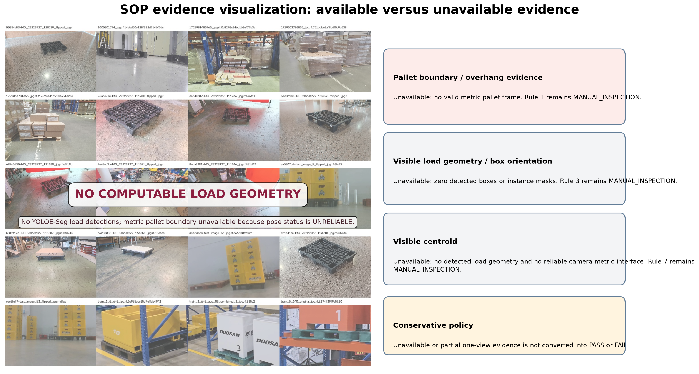

# Delhivery Pallet Pose Estimation & Load Compliance

An end-to-end computer-vision prototype for pallet detection, front-edge geometry extraction, metric pose estimation, conservative single-view SOP assessment, and deployment planning. The system makes uncertainty explicit: insufficient visual evidence or a failed pose-quality gate results in `MANUAL_INSPECTION`, never an invented PASS/FAIL result.

## Project description

The project is organised as four connected stages:

1. detect the pallet and segment its visible front surface;
2. extract a fixed front-edge interface and estimate a floor-frame pose;
3. assess visible load/SOP evidence with conservative rules; and
4. package the pipeline for ONNX/INT8 experimentation and future Jetson validation.

## System Architecture



```text
RGB image → pallet detection + front segmentation → G0/G1 front edge
        → ray/floor pose geometry + quality gate → load/SOP evidence
        → explicit failure contract + temporal stability gate
```

## Key Results

| Area | Result | Interpretation |
|---|---:|---|
| Pallet detection | 0.968 mAP50 | Held-out box detection performance |
| Pallet-front segmentation | 0.887 mask mAP50–95 | Held-out geometry segmentation performance |
| Synthetic pose calibration | 0.325 px RMS | Procedure validation under reference simulation |
| Saved real-image pose | 28.40 px reprojection RMS | Fails the 3.00 px gate; status is `UNRELIABLE` |
| Saved SOP assessment | `MANUAL_INSPECTION` | Correctly conservative given unreliable pose and one view |
| INT8 ONNX size | 10.3 MB | 73.4% smaller than the 38.7 MB FP32 ONNX model |

## Section 1 — Detection

The supplied pallet datasets were converted to deterministic, source-group-aware single-class YOLO splits (seed `42`). The detector recognises `pallet`; the segmentation model recognises `pallet_front`, whose bottom-band extrema become the fixed geometry endpoints `G0` and `G1` for pose estimation.

| Model / held-out metric | Precision | Recall | mAP50 | mAP50–95 |
|---|---:|---:|---:|---:|
| Pallet detector (box) | 0.947 | 0.958 | 0.968 | 0.694 |
| Pallet-front model (box) | 0.947 | 1.000 | 0.981 | 0.898 |
| Pallet-front model (mask) | 0.947 | 1.000 | 0.981 | 0.887 |







## Section 2 — Pose



### Methodology

Calibrated camera rays through `G0` and `G1` are intersected with the floor plane. The front-edge midpoint, nominal pallet width, and a right-handed perpendicular recover the pallet centre and yaw; constrained reprojection refinement then quality-gates the candidate pose.

The geometry uses explicit reference assumptions: a 1.20 m × 1.00 m pallet, 0.144 m deck height, and a 640 × 480 calibration convention. Synthetic evaluation validates the estimator workflow, not a physical warehouse deployment.

| Pose evaluation | Value |
|---|---:|
| Synthetic calibration RMS / P95 / max | 0.325 / 0.647 / 1.050 px |
| 1 px endpoint-noise P95 translation | 0.070 m |
| 1 px endpoint-noise P95 rotation | 4.452° |
| 1 px endpoint-noise pass rate | 43% |
| Passing synthetic envelope | 1.0 m at tested 0–50° views |

The saved real image has `G0=(395,279)` and `G1=(497,279)`, but reprojection RMS is 28.40 px versus the 3.00 px acceptance gate. Its numeric candidate pose is therefore not consumed downstream.





## Section 3 — SOP

The load-analysis layer uses YOLOE-Seg prompts for visible cartons/packages and applies SOP-PAL-03 rules with an evidence-first policy. A rule is PASS only when it is sufficiently observable; unknown is not treated as compliant.



| Rule | Threshold / expectation | Single-view policy |
|---|---|---|
| Overhang | ≤ 3 cm | Visible geometry only |
| Height | ≤ 1.80 m | Manual until vertical metric geometry is available |
| Box rotation | ≤ 15° | Visible boxes only |
| Size ordering | Larger below smaller | Manual; hidden layers are unobservable |
| Stretch wrap | Complete wrapping | Manual; one view cannot prove completeness |
| Damage | No visible damage | Partial/manual; no dedicated damage model |
| Centroid | ≤ 10 cm | Visible geometric proxy, not mass centroid |
| Pallet damage | No damage | Visible pallet surfaces only |

For a scalar measurement `x` with uncertainty `σ`: PASS if `x + 2σ ≤ threshold`; FAIL if `x - 2σ > threshold`; otherwise `MANUAL_INSPECTION`. The saved assessment reports no load detections and all rules as `MANUAL_INSPECTION`, which is the intended safe outcome.

## Section 4 — Deployment

The deployment boundary exports the Section 1 geometry model to ONNX, evaluates an optional static INT8 conversion, preserves explicit failure states, and proposes a five-frame stability gate for stationary pallets.

| Apple M2 measurement | Mean latency | P95 latency |
|---|---:|---:|
| Geometry model, PyTorch CPU | 204.11 ms | 298.44 ms |
| Geometry model, PyTorch MPS | 78.44 ms | 136.01 ms |
| Section 3 end-to-end CPU | 451.88 ms | 515.38 ms |
| Geometry ONNX FP32, ORT CPU | 309.80 ms | 473.48 ms |
| Geometry ONNX INT8, ORT CPU | 202.94 ms | 264.81 ms |

| ONNX / INT8 result | FP32 | INT8 |
|---|---:|---:|
| Box mAP50 | 0.9806 | 0.9791 |
| Mask mAP50–95 | 0.8747 | 0.8586 |
| Model size | 38.7 MB | 10.3 MB |
| Mean FPS on M2 ORT CPU | 3.23 | 4.93 |

The target is Jetson Orin Nano at 15 W and ≥15 FPS (66.67 ms/frame). Jetson hardware was not available, so Jetson latency, throughput, memory, power, thermals, and TensorRT performance remain unmeasured acceptance tests—not estimates derived from Mac results.

## Failure Analysis




The primary observed failure is a pose reprojection RMS of 28.40 px, exceeding the 3 px gate. This correctly propagates from `UNRELIABLE` pose to `MANUAL_INSPECTION` rather than producing a usable-looking metric pose. A single RGB view also cannot establish hidden layers, full stretch-wrap coverage, unseen pallet faces, mass centroid, or reliable damage absence. Explicit states such as `NO_DETECTION`, `GEOMETRY_UNRELIABLE`, `POSE_UNRELIABLE`, and `SOP_UNCERTAIN` prevent those cases from being silently represented as success.

## Limitations / Future Work

- Calibrate the target camera and measure actual pallet dimensions.
- Collect physical pose ground truth to validate real-world accuracy.
- Build representative annotated data for cartons, damage, wrapping, and loading SOPs.
- Add multi-view or depth evidence for hidden faces, layers, height, and full-load compliance.
- Validate ONNX/TensorRT FP16 and INT8 directly on the Jetson at 15 W, including p95 end-to-end latency, memory, power, and thermals.
- Retain conservative quality gates and manual-inspection fallbacks throughout deployment.

For full reproducibility details and commands, see the existing [root README](README.md), [pose documentation](section2_pose/README.md), and [deployment README](section4_deployment/README.md).
